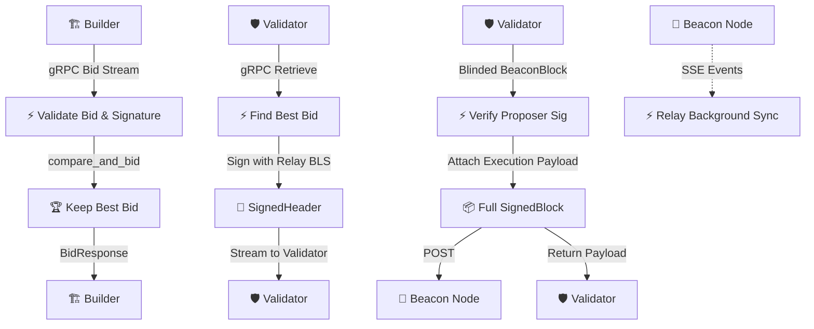
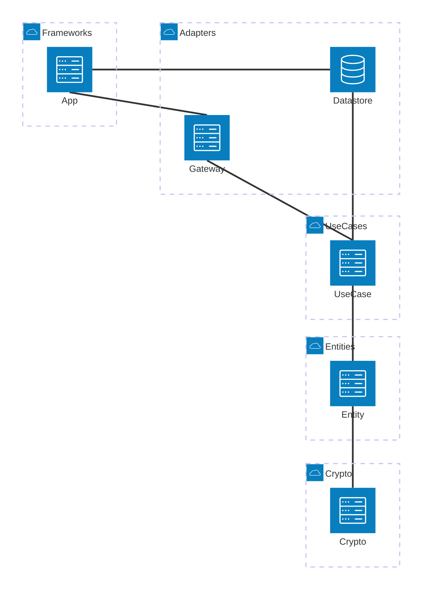
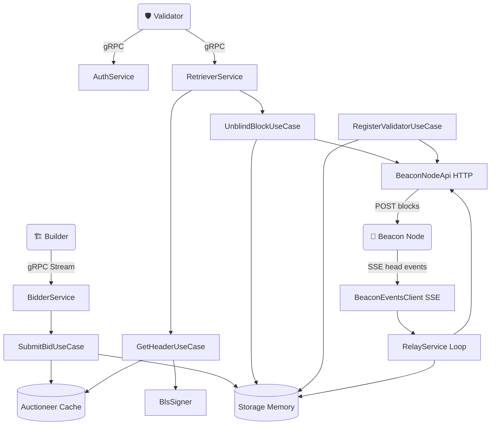

# ⚡ mev-relay-rs

**High-performance MEV Relay for Ethereum PBS, written in Rust**

[](https://www.rust-lang.org/)
[](LICENSE)
[](Cargo.toml)
[](https://grpc.io/)
[](https://ethereum.org)

_Proposer-Builder Separation relay with Clean Architecture, gRPC streaming, and BLS12-381 cryptography_

---

[Architecture](#-architecture) · [How It Works](#-how-it-works) · [Crate Map](#-crate-map) · [API](#-grpc-api) · [Getting Started](#-getting-started)

---

## 📖 What is this?

**mev-relay-rs** is an Ethereum [Proposer-Builder Separation (PBS)](https://ethresear.ch/t/proposer-builder-separation-friendly-fee-market-designs/9725) relay — a critical piece of infrastructure that sits between **block builders** and **validators** in the Ethereum MEV supply chain.

The relay acts as a **trusted auctioneer**: it receives block bids from builders, validates them cryptographically, selects the most profitable block for each slot, and delivers it to the proposing validator — all without revealing block contents until the validator commits.

### Why another relay?

| Goal                   | How                                                                                                         |
| ---------------------- | ----------------------------------------------------------------------------------------------------------- |
| **Performance**        | Rust + gRPC streaming (not REST polling) for sub-millisecond bid processing                                 |
| **Clean Architecture** | Strict layer separation — business logic never touches transport or infra                                   |
| **Type Safety**        | BLS keys, signatures, and domain separation are compile-time safe via newtype wrappers                      |
| **Modularity**         | 10 focused crates with explicit dependency boundaries; swap storage or transport without touching use cases |

---

## 🔑 How It Works

The relay orchestrates three core flows in the PBS pipeline:



### In short

1. **Builders** compete by streaming block bids over gRPC. The relay validates each bid (BLS signature, builder whitelist, slot/payload correctness) and keeps only the highest-value bid per slot.

2. **Validators** request the winning block header for their upcoming slot. The relay signs the header with its own BLS key, ensuring the validator can commit without seeing block contents.

3. **Validators** submit a signed blinded beacon block. The relay verifies the proposer's BLS signature, "unblinds" the block by attaching the builder's execution payload, publishes the full block to the beacon chain, and returns the execution payload to the validator.

---

## 🏛 Architecture

The project follows **Clean Architecture** (Ports & Adapters), with strict unidirectional dependency flow:



> **Dependency Rule:** arrows point inward only. `crypto` knows nothing about the outside world. `entity` knows nothing about storage or gRPC. Business logic in `usecase` depends on traits, never on concrete implementations.

---

## 📦 Crate Map

```
mev-relay-rs/
├── Cargo.toml                # Workspace root
└── crates/
    ├── crypto/               # BLS12-381 primitives (blst)
    ├── entity/               # Domain types — BidTrace, ExecutionPayload, etc.
    ├── usecase/              # Business logic — SubmitBid, GetHeader, etc.
    ├── gateway/              # External adapters — BlsSigner, BeaconAPI, SSE
    ├── datastore/            # Data layer — Auctioneer (moka), Storage (in-memory)
    ├── api/                  # gRPC services (tonic) + proto definitions
    ├── health/               # HTTP health check endpoint
    └── app/                  # Composition root — DI, CLI, Relay::run()
```

| Crate         | Purpose                                                                   | Key Types                                                                                                                                         |
| ------------- | ------------------------------------------------------------------------- | ------------------------------------------------------------------------------------------------------------------------------------------------- |
| **crypto**    | BLS12-381 cryptography via `blst`. Innermost layer — zero workspace deps. | `BlsPublicKey`, `BlsSignature`, `BlsSecretKey`, `SignedRoot`, `ForkData`, `ForkDatas`                                                             |
| **entity**    | Pure domain models. No I/O, no frameworks.                                | `BidTrace`, `BidSubmission`, `ExecutionPayload`, `HeadSlot`, `ValidatorRegistration`, `ProposerDuty`, `PayloadAttributes`, `BlindedBlockResponse` |
| **usecase**   | Application business rules. Depends on traits from datastore/gateway.     | `SubmitBidUseCase`, `GetHeaderUseCase`, `RegisterValidatorUseCase`, `UnblindBlockUseCase`                                                         |
| **gateway**   | Outbound adapters for external services.                                  | `BlsSigner`, `BeaconNodeApi`, `BeaconEventsClient`, `BeaconService`, `MbsAuth`                                                                    |
| **datastore** | Data persistence layer with trait abstractions.                           | `Auctioneer` trait, `Storage` trait, `MemoryAuctioneer` (moka cache), `MemoryStorage`                                                             |
| **api**       | gRPC transport layer — proto definitions + tonic service impls.           | `BidderService`, `RetrieverService`, `AuthService`, proto-entity conversions                                                                      |
| **health**    | Minimal HTTP server for liveness/readiness probes.                        | Health check endpoint                                                                                                                             |
| **app**       | Composition root. Wires everything together and runs the relay.           | `Relay`, `RelayConfig`, `CliArgs`, `RelayService`                                                                                                 |

---

## 📡 gRPC API

All builder/validator communication uses **gRPC** (via [tonic](https://github.com/hyperium/tonic)) instead of traditional REST, enabling streaming bids and lower latency.

### BidderService — Builder to Relay

Builders stream block bids to the relay. Each bid contains a `BidTrace` (slot, hashes, value), the full `ExecutionPayload`, an optional `BlobsBundle`, and a BLS signature.

```protobuf
service BidderService {
  rpc Bid(stream BidRequest) returns (BidResponse);
}
```

### RetrieverService — Validator to Relay

Validators request the best available bid for their slot. The relay responds with a signed header and the execution payload via a server-side stream.

```protobuf
service RetrieverService {
  rpc Retrieve(RetrieveRequest) returns (stream RetrieveResponse);
}
```

### AuthService — Identity Verification

Nonce-challenge + BLS signature verification produces a JWT token. Used to authenticate builders and validators before granting access to bid/retrieve streams.

```protobuf
service AuthService {
  rpc Nonce(NonceRequest) returns (NonceResponse);
  rpc Token(TokenRequest) returns (TokenResponse);
}
```

---

## 🔄 System Interaction Diagram

The full data flow across all components:



---

## 🏁 Getting Started

### Prerequisites

```bash
# Rust toolchain (1.94+)
curl --proto '=https' --tlsv1.2 -sSf https://sh.rustup.rs | sh

# Required for protobuf compilation and BLS crypto
brew install protobuf
brew install libffi pkg-config   # blst on Apple Silicon

# Task runner (optional)
brew install just
```

### Build

```bash
# Format, lint, and fix
just fmt

# Run tests
just test
```

### Run

```bash
# Basic run (all defaults)
cargo run --release -- \
  --bls-secret-key YOUR_BLS_SECRET_KEY \
  --beacon.url http://127.0.0.1:3500

# With builder whitelist
cargo run --release -- \
  --bls-secret-key YOUR_BLS_SECRET_KEY \
  --beacon.url http://127.0.0.1:3500 \
  --builders.enabled PUBKEY_1,PUBKEY_2 \
  --chain mainnet
```

### CLI Options

| Flag                 | Default                    | Description                                     |
| -------------------- | -------------------------- | ----------------------------------------------- |
| `--grpc.port`        | `50051`                    | gRPC server port (builder/validator API)        |
| `--http.port`        | `9063`                     | HTTP port (health check)                        |
| `--beacon.url`       | `http://127.0.0.1:3500`    | Beacon node endpoint                            |
| `--auth.url`         | `https://auth.example.com` | External auth service URL                       |
| `--builders.enabled` | —                          | Comma-separated whitelisted builder BLS pubkeys |
| `--bls-secret-key`   | **required**               | Relay's BLS secret key for header signing       |
| `--chain`            | `mainnet`                  | Network: mainnet, holesky, sepolia, goerli, dev |
| `--epoch.slots`      | `32`                       | Slots per epoch                                 |

---

## 🧪 Testing

```bash
# Run all tests
just test

# Format + lint + clippy fix
just fmt
```

Mock implementations (MockAuctioneer, MockStorage) are provided in the datastore crate for unit-testing use cases in isolation.

---

## 🛠 Tech Stack

| Category          | Technologies                                                    |
| ----------------- | --------------------------------------------------------------- |
| **Language**      | Rust 1.94+ (Edition 2024)                                       |
| **Crypto**        | blst (BLS12-381), tree_hash / ethereum_ssz                      |
| **Transport**     | tonic (gRPC), reqwest (HTTP), Server-Sent Events                |
| **Async Runtime** | tokio (multi-threaded)                                          |
| **Storage**       | moka (concurrent cache with TTL), parking_lot (sync primitives) |
| **Serialization** | serde / prost (protobuf)                                        |
| **Observability** | tracing + OpenTelemetry                                        |
| **CLI**           | clap (derive API)                                               |
| **Build**         | just (task runner), pre-commit hooks                            |

---

## 📄 License

This project is licensed under the [MIT License](LICENSE).

You are free to use, modify, and distribute this software for any purpose, commercial or non-commercial, provided that the original copyright notice and permission notice are included in all copies or substantial portions of the software.

Copyright (c) 2026 Vladyslav Taran
